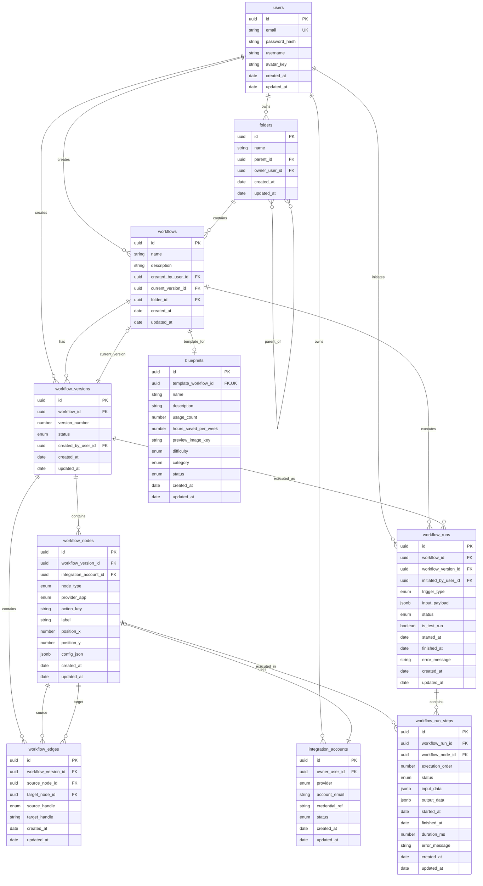

# Database Entity Relationship Diagram

This diagram visualizes the relationships between all tables in the Automation Workflow Builder database.

## ER Diagram

## Relationship Summary

| From Table          | To Table             | Relationship | Description                                      |
| ------------------- | -------------------- | ------------ | ------------------------------------------------ |
| `users`             | `workflows`          | 1:N          | A user can create many workflows                 |
| `users`             | `workflow_versions`  | 1:N          | A user can create many versions                  |
| `users`             | `integration_accounts` | 1:N        | A user can have many integration accounts        |
| `users`             | `workflow_runs`      | 1:N          | A user can initiate many workflow runs           |
| `users`             | `folders`            | 1:N          | A user can own many folders                      |
| `folders`           | `workflows`          | 1:N          | A folder contains many workflows                 |
| `folders`           | `folders`            | 1:N          | A folder can have child folders                  |
| `workflows`         | `folders`            | N:1          | A workflow belongs to one folder                 |
| `workflows`         | `workflow_versions`  | 1:N          | A workflow has many versions                     |
| `workflows`         | `blueprints`         | 1:1          | A workflow can be a template for one blueprint   |
| `workflows`         | `workflow_runs`      | 1:N          | A workflow can have many runs                    |
| `workflow_versions` | `workflow_nodes`     | 1:N          | A version contains many nodes                    |
| `workflow_versions` | `workflow_edges`     | 1:N          | A version contains many edges                    |
| `workflow_versions` | `workflow_runs`      | 1:N          | A version can be executed many times             |
| `workflow_nodes`    | `workflow_edges`     | 1:N          | A node can be source/target of many edges        |
| `workflow_nodes`    | `integration_accounts` | N:1        | A node can use one integration account           |
| `workflow_nodes`    | `workflow_run_steps` | 1:N          | A node can be executed in many run steps         |
| `workflow_runs`     | `workflow_run_steps` | 1:N          | A run contains many execution steps              |

## Visual Legend

- **PK** = Primary Key
- **FK** = Foreign Key
- **UK** = Unique Key
- `||--o{` = One-to-Many relationship
- `||--||` = One-to-One relationship
- `|o--||` = Zero-or-One to One relationship
